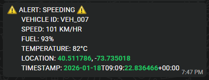

# 🚗 Vehicle IoT Telemetry Data Pipeline

**End-to-End Real-Time Analytics Architecture using Apache Kafka, Apache Flink, and Azure**

## Overview

Fleetage Mobility require real-time visibility into vehicle behavior to proactively detect safety and operational anomalies. This project implements a scalable streaming data platform that ingests vehicle telemetry, performs real-time anomaly detection, and triggers automated driver notifications.

The solution is designed around a modern event-driven architecture using Apache Kafka and Apache Flink, integrated with Azure serverless services for real-time alert delivery. While the overall platform design supports both hot-path and cold-path analytics, this implementation focuses on **Phase 1 (Hot Path)** based on stakeholder priority for urgent real-time alerting requirements.

---

## Business Context

Fleetage Mobility (imaginary company) operates commercial vehicles equipped with telemetry sensors capturing speed, fuel level, engine temperature, and GPS coordinates. The organization required a low-latency pipeline capable of detecting critical driving conditions such as overspeeding, fuel depletion, and overheating, and notifying drivers within seconds to reduce operational risk and vehicle downtime.

> Due to the learning and prototyping nature of this project, physical IoT devices were simulated using a custom telemetry data generator.

---

## Project Scope (Phase 1 – Hot Path Only)

This implementation delivers a real-time Proof of Concept with the following capabilities:

* Kafka-based telemetry ingestion
* Stream processing with Apache Flink
* Real-time anomaly detection
* Unified alert topic generation
* Notification delivery via Twilio integration
* End-to-end streaming observability

> Cold-path analytics components are included in the architecture design for future extension but are not implemented in this phase.

---

## Architecture

### 🔥 Hot Path (Implemented)

**Flow:**
Telematics Device (Simulated) → Kafka → Flink → Alert Topic → HTTP Sink → Azure Function → Twilio → Driver Notification

Key Characteristics:

* Event-driven processing
* Sub-second alert latency
* Stateless and stateful stream operators
* Serverless notification triggering


---

### ❄️ Cold Path (Planned – Not Implemented)

**Flow:**
Kafka → Flink → Azure Blob Storage → ADLS Gen2 → ADF → Synapse Analytics

Cold path is designed for historical analytics, reporting, and BI workloads.


---

## Technology Stack

| Layer                | Technology                              |
| -------------------- | --------------------------------------- |
| Streaming Platform   | Apache Kafka                            |
| Schema Management    | Confluent Schema Registry (Avro)        |
| Stream Processing    | Apache Flink                            |
| Programming Language | Python (Producer & Consumer Simulation) |
| Cloud Platform       | Microsoft Azure                         |
| Notification Service | Twilio API                              |
| Alert Delivery       | Azure Functions (Production Design)     |
| Environment          | Dev                                     |
| Kafka Cluster        | vehicle_telemetry                       |
| Telemetry Topic      | vehicle.telemetry                       |
| Alert Topic          | vehicle.alerts.notifications            |

---

## Data Flow Implementation

### Telemetry Ingestion

* A Python-based telemetry simulator mimics IoT CAN bus sensor behavior.
* Vehicle events are continuously produced to Kafka topic:

```
vehicle.telemetry
```

* Messages are serialized using **Avro schema** via Schema Registry to enforce data quality and compatibility.

---

### Real-Time Stream Processing

Apache Flink consumes streaming telemetry and evaluates business rules in real time:

| Rule        | Condition           |
| ----------- | ------------------- |
| Speeding    | Speed > 80 km/h     |
| Low Fuel    | Fuel < 10%          |
| Overheating | Temperature > 200°C |

Detected anomalies are unified into a single downstream topic:

```
vehicle.alerts.notifications
```

This design simplifies alert consumption and downstream integrations.

---

### Notification Delivery

For learning and local testing:

* A Python consumer reads from `vehicle.alerts.notifications`
* Alerts are pushed to drivers via **Twilio WhatsApp API**

For production architecture:

* Flink HTTP Sink Connector directly invokes Azure Functions
* Azure Functions handle Twilio API integration
* Fully serverless, scalable alert dispatch mechanism

---

## Demo Artifacts

### Telemetry Topic Stream

Live Kafka telemetry feed:


---

### Alert Topic Stream

Unified anomaly alert stream:


---

### Driver Notification Example

WhatsApp alert delivered using Twilio:



> Here WhatApp notification is used due to the learning and prototyping nature of this project. But in real life situation Call notification would be used for alerting the driver.

---

## Key Engineering Highlights

* Event-driven microservices architecture
* Unified alert topic design pattern
* Avro-based schema governance
* Stream filtering with Flink DataStream API
* Fault-tolerant Kafka consumers
* Production-aligned HTTP Sink integration pattern
* Decoupled notification delivery layer

---

## Skills Gained From This Project

This project strengthened hands-on expertise across multiple production-grade data engineering concepts:

### Streaming & Messaging

* Kafka topic design
* Producer/consumer implementation
* Partitioning concepts
* Offset management
* Avro serialization and schema registry integration

### Stream Processing

* Apache Flink job development
* Stateful stream filtering
* Window-less event processing
* Real-time anomaly detection logic
* Event routing patterns

### Cloud Integration

* Azure serverless architecture patterns
* HTTP-triggered Azure Functions
* Event-driven notification pipelines
* Real-time system design on Azure

### Data Engineering Practices

* Hot-path vs Cold-path architecture separation
* Streaming-first pipeline design
* Scalable alert fan-out architecture
* Production POC delivery practices

---

## Limitations & Learning Assumptions

* Physical IoT devices were simulated using Python producers
* Local Python consumers replaced Azure Functions during development
* Cold path implementation is architecturally designed but not executed in Phase 1
* Project executed in a development environment

---

## Future Enhancements (Phase 2)

* Azure Data Lake archival
* Delta Lake bronze/silver/gold modeling
* Azure Data Factory ETL pipelines
* Synapse Analytics reporting layer
* Power BI fleet dashboards
* Historical trend analysis

---

## Acknowledgment

Special thanks to **Codebasics** for providing structured guidance and real-world project frameworks as part of their Data Engineering program. Their curriculum significantly contributed to understanding enterprise streaming architectures and cloud-native pipeline design.
